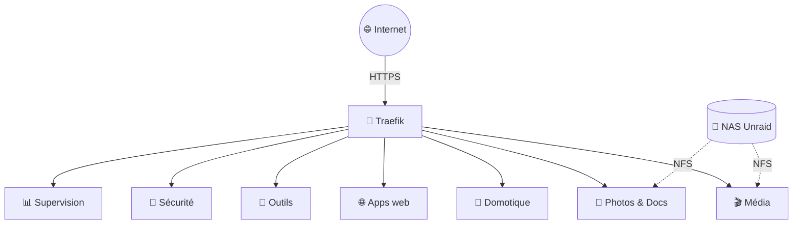
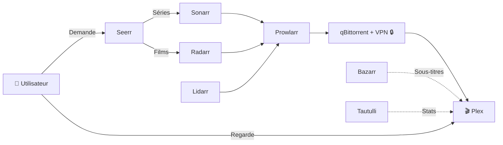
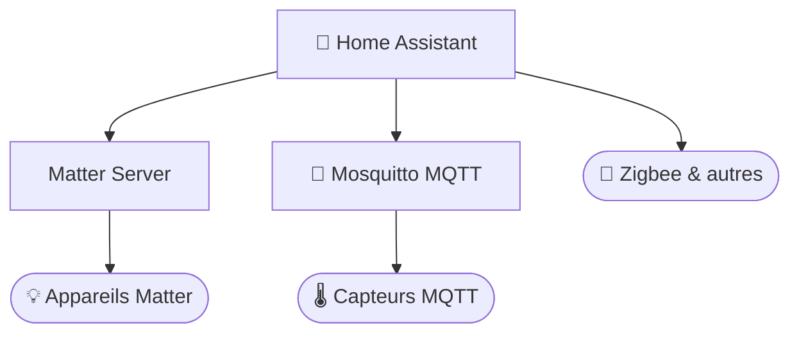
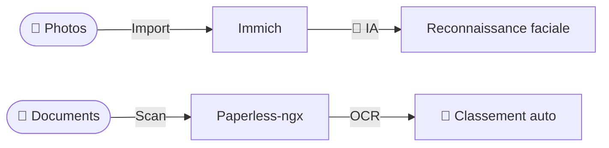
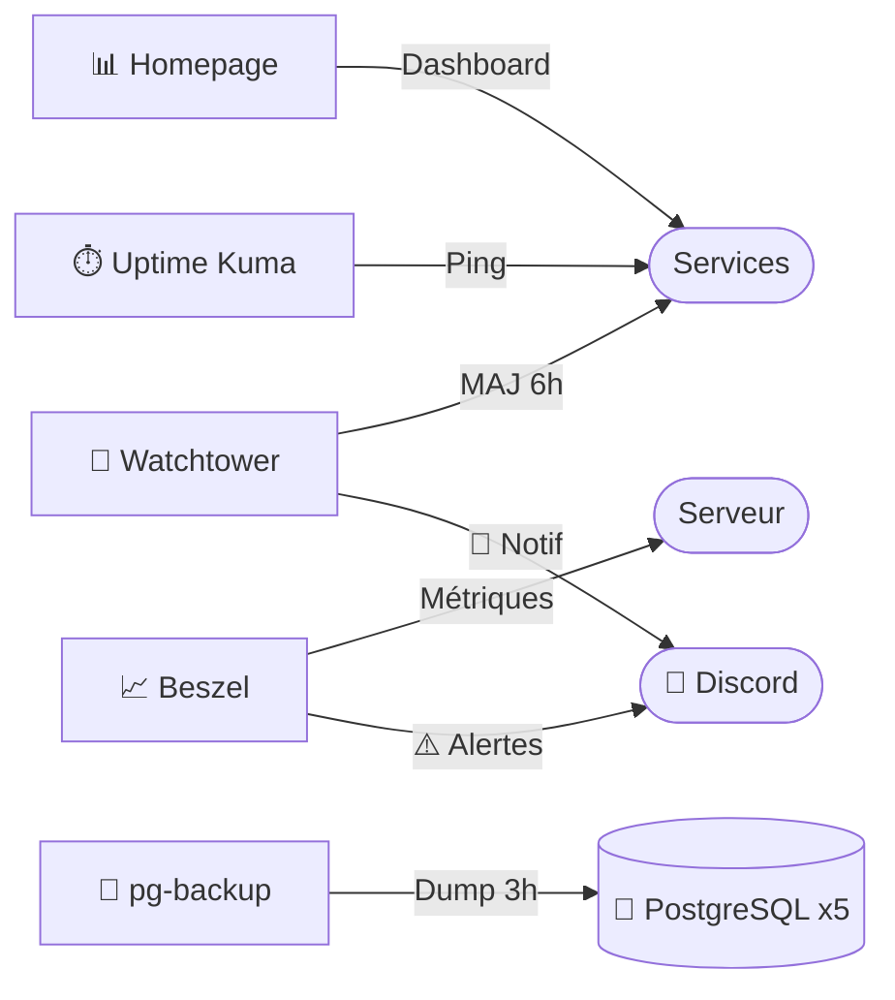
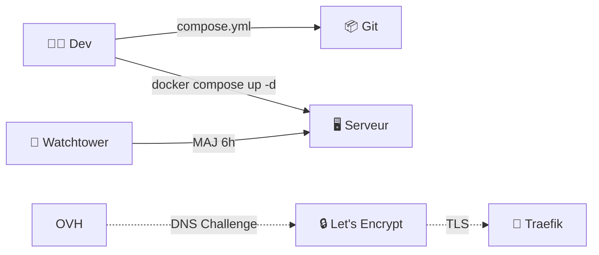

# 🏠 Home Server Platform

> Plateforme auto-hébergée · ~30 services Docker · Debian · HTTPS automatique via `*.example.com`

Streaming multimédia, domotique, gestion documentaire, galerie photo et outils de productivité — accessible partout, 100% sous votre contrôle.

---

## 🎯 Ce que ça fait

| | Fonctionnalité | Description |
|---|---|---|
| 🎬 | **Streaming multimédia** | Films, séries, musique en streaming avec téléchargement automatisé |
| 📱 | **Demandes de contenu** | Les utilisateurs demandent, le système télécharge automatiquement |
| 🏡 | **Maison connectée** | Contrôle des appareils Matter, MQTT et Zigbee |
| 📸 | **Galerie photo IA** | Reconnaissance faciale et recherche intelligente |
| 📄 | **GED intelligente** | Numérisation OCR et classement automatique |
| 🔐 | **Sécurité** | Mots de passe, secrets, blocage pub DNS |
| 📊 | **Supervision 24/7** | Métriques, logs, alertes Discord, mises à jour auto |

---

## 🏗️ Architecture

---

## 🎬 Média & Divertissement

| Service | Rôle | URL |
|---|---|---|
|  **Plex** | Streaming films, séries, musique | `plex.example.com` |
|  **Seerr** | Demande et découverte de contenu | `seerr.example.com` |
|  **Sonarr** | Gestion automatisée des séries | `sonarr.example.com` |
|  **Radarr** | Gestion automatisée des films | `radarr.example.com` |
|  **Lidarr** | Gestion automatisée de la musique | `lidarr.example.com` |
|  **Bazarr** | Sous-titres automatiques | `bazarr.example.com` |
|  **Prowlarr** | Gestion des indexeurs | `indexer.example.com` |
|  **qBittorrent** | Téléchargement (VPN intégré) | `qbittorrent.example.com` |
|  **Tautulli** | Statistiques Plex | `tautulli.example.com` |

---

## 🏡 Domotique

| Service | Rôle | URL |
|---|---|---|
|  **Home Assistant** | Hub domotique centralisé | `home-assistant.example.com` |
| 🔌 **Mosquitto** | Broker MQTT | _interne_ |
| 🔗 **Matter Server** | Protocole Matter | _interne_ |

---

## 📸 Photos & Documents

| Service | Rôle | URL |
|---|---|---|
|  **Immich** | Galerie photo avec IA | `immich.example.com` |
|  **Paperless-ngx** | GED avec OCR | `paperless.example.com` |

---

## 🌐 Applications personnelles

| Service | Rôle | URL |
|---|---|---|
| ✍️ **Blog** | Blog personnel | `blog.example.com` |
| 📋 **CV en ligne** | Curriculum vitae interactif | `cv.example.com` |
| 🏢 **Copro-Pilot** | Gestion de copropriété | `copro-pilot.example.com` |
| 🎲 **The Box** | Collection de jeux | `the-box.example.com` |

---

## 🔧 Outils de productivité

| Service | Rôle | URL |
|---|---|---|
|  **Stirling PDF** | Manipulation PDF | `stirling.example.com` |
|  **Memos** | Notes rapides | `memos.example.com` |
|  **Wakapi** | Suivi temps de dev | `wakapi.example.com` |
| 🌳 **Gramps Web** | Généalogie | `gramps.example.com` |

---

## 🔐 Sécurité

| Service | Rôle | URL |
|---|---|---|
|  **Vaultwarden** | Mots de passe (Bitwarden) | `vaultwarden.example.com` |
|  **Infisical** | Secrets applicatifs | `infisical.example.com` |
|  **Pi-hole** | Blocage pub DNS | `pihole.example.com` |

> 🔒 Les secrets (`.env`) ne sont jamais commités. Homepage utilise `{{HOMEPAGE_VAR_*}}` pour la substitution d'environnement.

---

## 📊 Supervision & Opérations

| Service | Rôle | URL |
|---|---|---|
|  **Homepage** | Tableau de bord | `homepage.example.com` |
|  **Beszel** | Métriques système + alertes Discord | `beszel.example.com` |
|  **Uptime Kuma** | Surveillance disponibilité | `uptime.example.com` |
|  **Portainer** | Gestion Docker | `portainer.example.com` |
|  **Dozzle** | Logs temps réel | `dozzle.example.com` |
| 🔄 **Watchtower** | MAJ auto quotidiennes + alertes Discord | _arrière-plan_ |
| 💾 **pg-backup** | Backup PostgreSQL (5 bases, rétention 7j) | _arrière-plan_ |
|  **Unifi** | Contrôleur réseau | `unifi.example.com` |

---

## 🚀 Déploiement

> Pas de CI/CD — déploiement manuel `docker compose up -d`. Watchtower met à jour les images quotidiennement.

---

## ⚙️ Stack technique

| Composant | Technologie |
|---|---|
| 🐳 Orchestration | Docker + Docker Compose |
| 🔀 Proxy inverse | Traefik v3.6 (Let's Encrypt / OVH DNS) |
| 🐘 Bases de données | PostgreSQL 16, Redis / Valkey |
| 💾 Sauvegarde | pg-backup — dump quotidien 3h, rétention 7j |
| 📁 Stockage | NAS Unraid via NFS |
| 📊 Supervision | Beszel, Uptime Kuma, Dozzle, Portainer, Homepage |
| 🔒 Sécurité | `no-new-privileges`, réseaux internes isolés |
| 🌐 Domaine | `example.com` (sous-domaine par service) |

---

## 💾 Backup PostgreSQL

| Base | Conteneur source |
|---|---|
| 📄 Paperless | `paperless-db` |
| 📸 Immich | `immich_postgres` |
| 🎲 The Box | `the-box-postgres` |
| 🏢 Copro-Pilot | `copro-pilot-postgres` |
| 🔐 Infisical | `infisical-db` |

> ⏰ Dump quotidien à 3h · Format `pg_dump -Fc` · Rétention 7 jours · Restauration via `pg_restore`

---

## 🗺️ Feuille de route

### 🔴 Haute priorité

- **Stockage NAS unifié** — Consolider les montages NFS (hardlinks + déplacements instantanés)
- **Sauvegardes off-site** — Réplication vers S3 / Backblaze B2 / second NAS
- **Tests de restauration** — Validation mensuelle de l'intégrité des backups

### 🟡 Moyenne priorité

- **Secrets centralisés** — Migration `.env` → Infisical (rotation auto)
- **Monitoring TLS** — Alerte avant expiration des certificats
- **Sauvegardes Redis** — Ajouter Redis (Immich, Paperless) au plan de backup

### 🟢 Basse priorité

- **Images versionnées** — Tags fixes sur les services critiques
- **Read-only rootfs** — `read_only: true` sur les conteneurs stateless

### ✅ Terminé

- ~~Rate limiting Vaultwarden~~ · ~~Uptime Kuma~~ · ~~Alertes Beszel → Discord~~
- ~~Healthchecks universels~~ · ~~Limites mémoire~~ · ~~Rotation des logs~~
- ~~Domaine variable~~ · ~~Nettoyage labels Traefik~~ · ~~Sécurité conteneurs~~
- ~~Isolation réseau~~ · ~~Alertes backup Discord~~ · ~~Documentation DR~~

---

## 📚 Documentation

| Document | Description |
|---|---|
| 📖 [Stack Multimédia](multimedia/README.md) | Architecture de la pile multimédia |
| 🔀 [Traefik](docs/traefik.md) | Proxy inverse, TLS, middlewares |
| 💾 [Stockage NFS](docs/stockage-nfs.md) | Montages Unraid, limitations |
| ➕ [Ajout d'un service](docs/ajout-service.md) | Guide pas à pas |
| 🐘 [Bases de données](docs/bases-de-donnees.md) | PostgreSQL, Redis, healthchecks |
| 🚨 [Reprise après sinistre](docs/reprise-sinistre.md) | Runbook de restauration |
| 🤖 [CLAUDE.md](CLAUDE.md) | Guide pour assistants IA |
