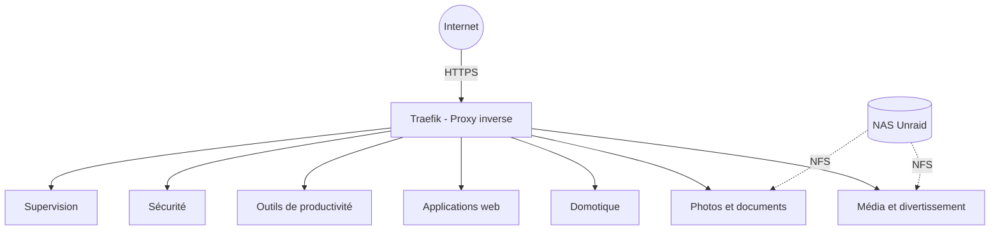
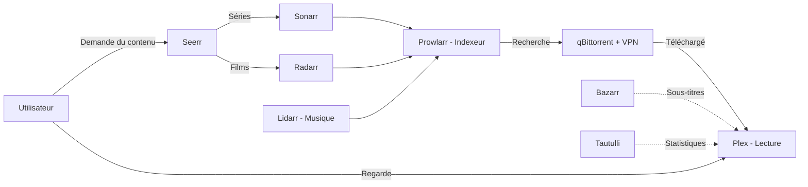
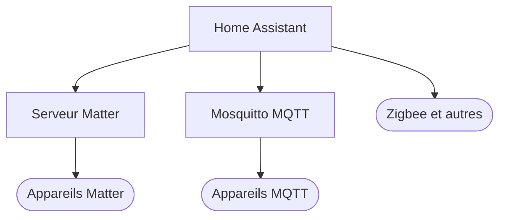
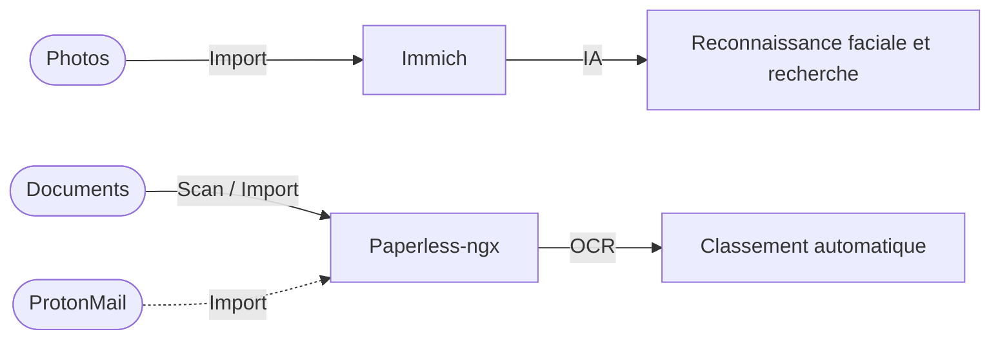
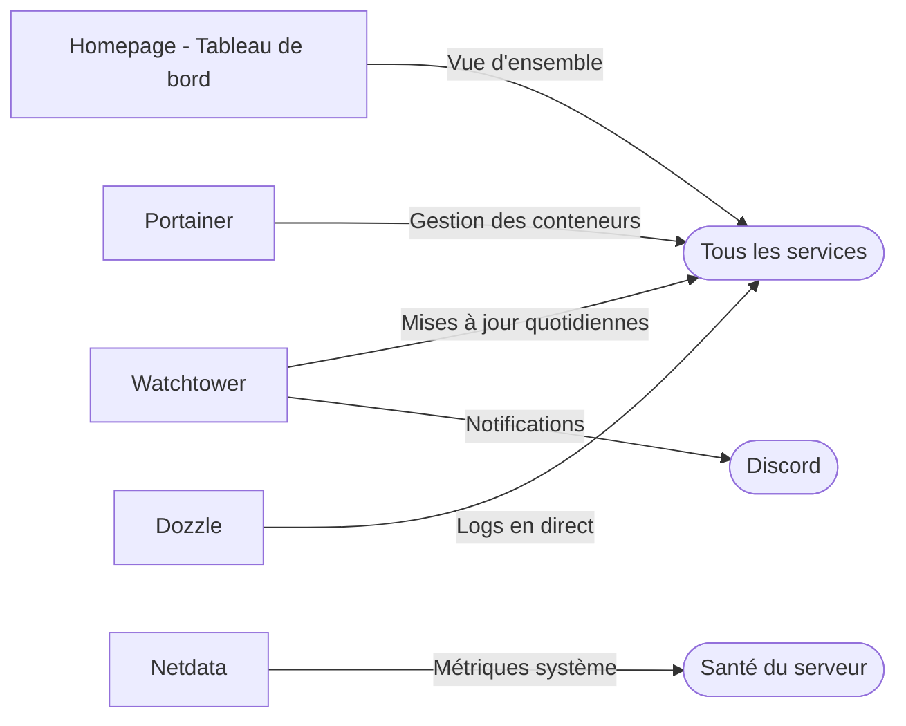
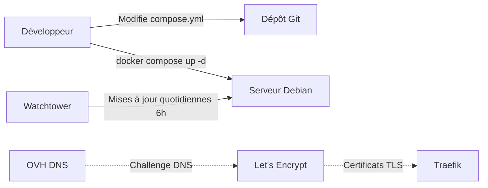

# Home Server Platform

Plateforme personnelle auto-hébergée offrant ~30 services sur un serveur Debian. Streaming multimédia, domotique, gestion de documents, stockage photo et outils de productivité — le tout accessible via `*.battistella.ovh` avec HTTPS automatique.

## Table des matières

- [À quoi sert ce produit ?](#à-quoi-sert-ce-produit-)
- [Fonctionnalités principales](#fonctionnalités-principales)
- [Comment ça fonctionne](#comment-ça-fonctionne)
- [Média et divertissement](#média-et-divertissement)
- [Domotique](#domotique)
- [Photos et documents](#photos-et-documents)
- [Applications web](#applications-web)
- [Outils de productivité](#outils-de-productivité)
- [Sécurité](#sécurité)
- [Opérations et supervision](#opérations-et-supervision)
- [Environnements](#environnements)
- [Déploiement](#déploiement)
- [Stack technique](#stack-technique)
- [Feuille de route](#feuille-de-route)
- [Documentation complémentaire](#documentation-complémentaire)

### Documentation technique

| Document | Description |
|----------|-------------|
| [Stack Multimédia](multimedia/README.md) | Architecture et configuration de la pile multimédia |
| [Traefik](docs/traefik.md) | Proxy inverse, routage, certificats TLS et middlewares |
| [Stockage NFS](docs/stockage-nfs.md) | Architecture de stockage, montages Unraid et limitations |
| [Ajout d'un service](docs/ajout-service.md) | Guide pas à pas pour ajouter un nouveau service |
| [Bases de données](docs/bases-de-donnees.md) | Configuration PostgreSQL et Redis/Valkey |

## À quoi sert ce produit ?

- **Regarder vos films et séries** en streaming depuis n'importe quel appareil
- **Automatiser l'acquisition de contenu** multimédia (films, séries, musique, sous-titres)
- **Contrôler votre maison connectée** via un hub domotique centralisé
- **Stocker et retrouver vos photos** grâce à la reconnaissance faciale et la recherche intelligente
- **Numériser et classer vos documents** avec OCR et tri automatique
- **Gérer vos mots de passe, notes et outils** de productivité au quotidien

## Fonctionnalités principales

- **Streaming multimédia complet** — Films, séries et musique via Plex, avec recherche et téléchargement automatisés
- **Requêtes de contenu** — Les utilisateurs demandent des films ou séries via Seerr, le reste est automatique
- **Domotique centralisée** — Pilotage des appareils Matter, MQTT et Zigbee depuis Home Assistant
- **Galerie photo intelligente** — Immich organise vos photos avec reconnaissance faciale et recherche par contenu
- **Gestion documentaire** — Paperless-ngx numérise, classe et rend cherchables tous vos documents papier
- **Sécurité des accès** — Mots de passe via Vaultwarden, secrets applicatifs via Infisical, blocage publicitaire via Pi-hole
- **Supervision complète** — Tableau de bord centralisé, logs en temps réel, métriques système et mises à jour automatiques
- **Applications personnelles** — Blog, CV en ligne, gestion de copropriété, collection de jeux, généalogie

## Comment ça fonctionne

Les utilisateurs accèdent à tous les services via leur navigateur en HTTPS. Traefik sert de point d'entrée unique et route chaque sous-domaine vers le bon conteneur. Les certificats TLS sont générés automatiquement via Let's Encrypt et le challenge DNS OVH. Le stockage multimédia et les photos sont hébergés sur un NAS Unraid, monté via NFS.

## Média et divertissement

Regardez vos films, séries et écoutez votre musique. Découvrez et demandez du contenu. Tout est automatisé — de la recherche au téléchargement, en passant par les sous-titres.

L'utilisateur demande un contenu via Seerr. Les gestionnaires (Sonarr, Radarr, Lidarr) interrogent les indexeurs via Prowlarr, puis lancent le téléchargement via qBittorrent (protégé par VPN). Le contenu est ensuite disponible dans Plex. Bazarr ajoute les sous-titres et Tautulli fournit les statistiques d'utilisation.

| Service | Fonction | URL |
|---|---|---|
| **Plex** | Streaming films, séries et musique | `plex.battistella.ovh` |
| **Seerr** | Demande et découverte de contenu | `seerr.battistella.ovh` |
| **Sonarr** | Gestion automatisée des séries | `sonarr.battistella.ovh` |
| **Radarr** | Gestion automatisée des films | `radarr.battistella.ovh` |
| **Lidarr** | Gestion automatisée de la musique | `lidarr.battistella.ovh` |
| **Bazarr** | Téléchargement automatique de sous-titres | `bazarr.battistella.ovh` |
| **Prowlarr** | Gestion des indexeurs de recherche | `indexer.battistella.ovh` |
| **qBittorrent** | Client de téléchargement (protégé par VPN) | `qbittorrent.battistella.ovh` |
| **Tautulli** | Statistiques d'utilisation de Plex | `tautulli.battistella.ovh` |

## Domotique

Pilotez et automatisez vos appareils connectés via un hub centralisé. Compatible Matter, MQTT, Zigbee et bien d'autres protocoles.

Home Assistant centralise le contrôle de tous vos appareils connectés. Le serveur Matter gère les appareils compatibles avec ce standard. Mosquitto sert de broker MQTT pour les capteurs et actionneurs IoT.

| Service | Fonction | URL |
|---|---|---|
| **Home Assistant** | Hub domotique et automatisations | `home-assistant.battistella.ovh` |
| **Mosquitto** | Broker de messages MQTT pour objets connectés | _interne_ |
| **Matter Server** | Support du protocole Matter | _interne_ |

## Photos et documents

Stockez et organisez vos photos avec recherche intelligente et reconnaissance faciale. Gérez vos documents avec OCR et classement automatique.

Immich permet d'importer vos photos et vidéos, puis les analyse automatiquement grâce à l'intelligence artificielle. Paperless-ngx numérise vos documents papier, les rend cherchables par OCR et les classe automatiquement. Un pont ProtonMail permet l'import de documents par e-mail.

| Service | Fonction | URL |
|---|---|---|
| **Immich** | Gestion de photos et vidéos avec IA | `immich.battistella.ovh` |
| **Paperless-ngx** | Gestion documentaire avec OCR | `paperless.battistella.ovh` |

## Applications web

Applications personnalisées développées sur mesure.

| Service | Fonction | URL |
|---|---|---|
| **Blog personnel** | Blog | `blog.battistella.ovh` |
| **CV en ligne** | Curriculum vitae interactif | `cv.battistella.ovh` |
| **Copro-Pilot** | Gestion de copropriété | `copro-pilot.battistella.ovh` |
| **The Box** | Gestionnaire de collection de jeux | `the-box.battistella.ovh` |
| **Techney** | Site de documentation technique | `techney.battistella.ovh` |
| **Invitation anniversaire** | Invitations avec RSVP | `leo-birthday.battistella.ovh` |

## Outils de productivité

| Service | Fonction | URL |
|---|---|---|
| **Stirling PDF** | Outils de manipulation PDF (fusion, découpe, conversion) | `stirling.battistella.ovh` |
| **Memos** | Prise de notes rapide | `memos.battistella.ovh` |
| **Wakapi** | Suivi du temps de développement | `wakapi.battistella.ovh` |
| **Gramps Web** | Généalogie et arbre familial | `gramps.battistella.ovh` |

## Sécurité

| Service | Fonction | URL |
|---|---|---|
| **Vaultwarden** | Gestionnaire de mots de passe (compatible Bitwarden) | `vaultwarden.battistella.ovh` |
| **Infisical** | Gestion des secrets et variables d'environnement | `infisical.battistella.ovh` |
| **Pi-hole** | Blocage publicitaire DNS sur tout le réseau | `pihole.battistella.ovh` |

### Gestion des secrets

Les clés API, mots de passe et tokens ne sont **jamais commités** dans le dépôt. Chaque service utilise un fichier `.env` co-localisé avec son `compose.yml` (automatiquement ignoré par le `.gitignore`).

**Homepage** utilise la substitution d'environnement native : les secrets sont stockés dans `homepage/.env` sous forme de variables `HOMEPAGE_VAR_*`, puis référencés dans `homepage/config/services.yaml` via la syntaxe `{{HOMEPAGE_VAR_*}}`. Le fichier `services.yaml` est lui aussi exclu du suivi git.

## Opérations et supervision

Homepage offre un tableau de bord centralisé de tous les services. Watchtower met à jour automatiquement les conteneurs chaque jour à 6h00 et notifie via Discord. Portainer et Dozzle permettent la gestion et le suivi des logs des conteneurs. Netdata surveille les performances du serveur.

| Service | Fonction | URL |
|---|---|---|
| **Homepage** | Tableau de bord centralisé | `homepage.battistella.ovh` |
| **Portainer** | Interface de gestion Docker | `portainer.battistella.ovh` |
| **Dozzle** | Visualiseur de logs en temps réel | `dozzle.battistella.ovh` |
| **Netdata** | Supervision des performances serveur | `netdata.battistella.ovh` |
| **Watchtower** | Mises à jour automatiques quotidiennes (alertes Discord) | _arrière-plan_ |
| **Unifi** | Contrôleur réseau (WiFi, switches) | _accès local_ |

## Environnements

| Environnement | URL | Description |
|---------------|-----|-------------|
| Production | `https://*.battistella.ovh` | Serveur domestique Debian |
| NAS | Unraid (réseau local) | Stockage multimédia et documents via NFS |

## Déploiement

Le déploiement se fait manuellement via `docker compose up -d` dans le répertoire du service concerné. Il n'y a pas de pipeline CI/CD (Intégration et Déploiement Continus). Les images des conteneurs sont mises à jour automatiquement chaque jour par Watchtower. Les certificats HTTPS sont renouvelés automatiquement via Let's Encrypt et le challenge DNS OVH.

## Stack technique

- **Orchestration :** Docker, Docker Compose
- **Proxy inverse :** Traefik v3.6 avec Let's Encrypt (challenge DNS OVH)
- **Bases de données :** PostgreSQL 16, Redis / Valkey
- **Stockage :** NAS Unraid via NFS
- **Supervision :** Netdata, Dozzle, Portainer, Homepage
- **Domaine :** `battistella.ovh` (sous-domaines par service)

## Feuille de route

- **Stockage NAS unifié** — Consolider les montages NFS en un seul partage pour activer les hardlinks et les déplacements instantanés de fichiers

## Documentation complémentaire

| Document | Description |
|----------|-------------|
| [Stack Multimédia](multimedia/README.md) | Architecture, configuration et variables d'environnement de la pile multimédia |
| [Traefik](docs/traefik.md) | Proxy inverse, routage, certificats TLS et middlewares de sécurité |
| [Stockage NFS](docs/stockage-nfs.md) | Architecture de stockage, montages Unraid et limitations hardlinks |
| [Ajout d'un service](docs/ajout-service.md) | Guide pas à pas pour ajouter un nouveau service à la plateforme |
| [Bases de données](docs/bases-de-donnees.md) | Configuration PostgreSQL et Redis/Valkey, healthchecks et persistance |
| [CLAUDE.md](CLAUDE.md) | Guide pour les assistants IA travaillant sur ce dépôt |
| [AGENT.md](AGENT.md) | Guide pour les agents IA autonomes |
