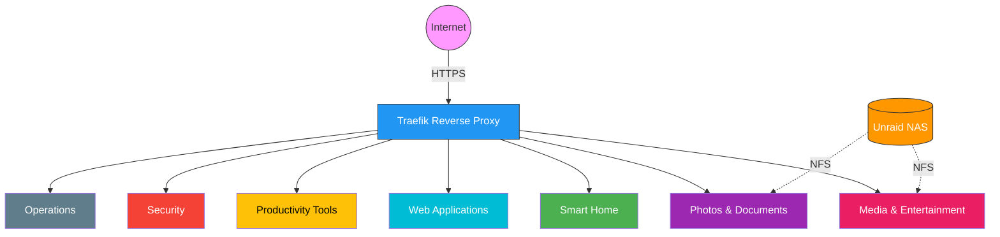
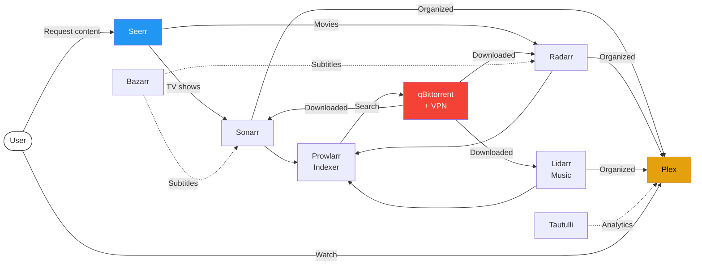
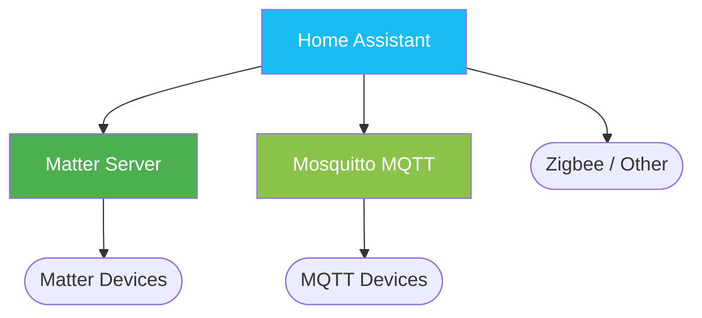
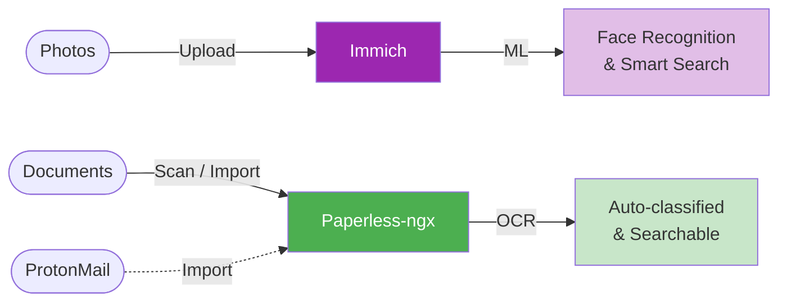
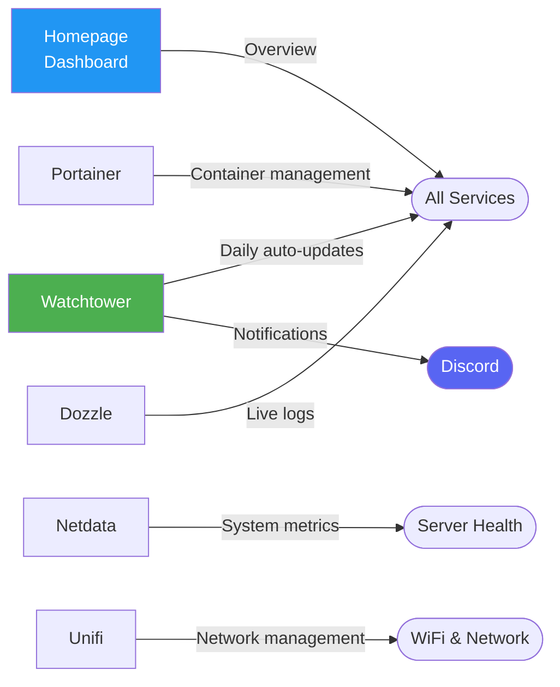
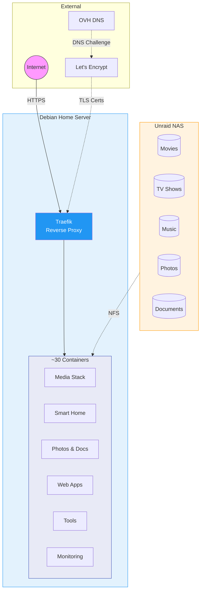

# Home Server Platform

A self-hosted personal cloud running ~30 services on a Debian home server, providing media streaming, smart home control, document management, photo storage, and more — all accessible via `*.battistella.ovh` with automatic HTTPS.

## Platform Overview

## Media & Entertainment

Stream movies, TV shows, and music. Discover and request new content. Everything is automated — from search to download to subtitles.

| Service | What it does | URL |
|---|---|---|
| **Plex** | Stream movies, TV shows, and music | `plex.battistella.ovh` |
| **Seerr** | Request and discover new content | `seerr.battistella.ovh` |
| **Sonarr** | Automate TV show acquisition | `sonarr.battistella.ovh` |
| **Radarr** | Automate movie acquisition | `radarr.battistella.ovh` |
| **Lidarr** | Automate music acquisition | `lidarr.battistella.ovh` |
| **Bazarr** | Automatic subtitle downloads | `bazarr.battistella.ovh` |
| **Prowlarr** | Manage search indexers | `indexer.battistella.ovh` |
| **qBittorrent** | Download client (VPN-protected) | `qbittorrent.battistella.ovh` |
| **Tautulli** | Plex usage analytics and stats | `tautulli.battistella.ovh` |

## Smart Home

Control and automate home devices through a central hub supporting Matter, MQTT, Zigbee, and more.

| Service | What it does | URL |
|---|---|---|
| **Home Assistant** | Smart home hub and automation | `home-assistant.battistella.ovh` |
| **Mosquitto** | MQTT message broker for IoT devices | _internal_ |
| **Matter Server** | Matter protocol support | _internal_ |

## Photos & Documents

Store and organize photos with AI-powered search and face recognition. Manage paperwork with OCR and automated sorting.

| Service | What it does | URL |
|---|---|---|
| **Immich** | Photo & video management with AI | `immich.battistella.ovh` |
| **Paperless-ngx** | Document management with OCR | `paperless.battistella.ovh` |

## Web Applications

Custom-built web apps for personal use.

| Service | What it does | URL |
|---|---|---|
| **Personal Blog** | Blog | `blog.battistella.ovh` |
| **Resume** | Online CV | `cv.battistella.ovh` |
| **Copro-Pilot** | Co-ownership management | `copro-pilot.battistella.ovh` |
| **The Box** | Game collection manager | `the-box.battistella.ovh` |
| **Techney** | Tech documentation site | `techney.battistella.ovh` |
| **Birthday Invitation** | Event invitations with RSVP | `leo-birthday.battistella.ovh` |

## Productivity Tools

| Service | What it does | URL |
|---|---|---|
| **Stirling PDF** | PDF manipulation tools (merge, split, convert…) | `stirling.battistella.ovh` |
| **Memos** | Quick notes and snippets | `memos.battistella.ovh` |
| **Wakapi** | Coding time tracking | `wakapi.battistella.ovh` |
| **Gramps Web** | Genealogy and family tree | `gramps.battistella.ovh` |

## Security

| Service | What it does | URL |
|---|---|---|
| **Vaultwarden** | Password manager (Bitwarden-compatible) | `vaultwarden.battistella.ovh` |
| **Infisical** | Secrets and environment variable management | `infisical.battistella.ovh` |
| **Pi-hole** | Network-wide DNS ad-blocking | `pihole.battistella.ovh` |

## Operations & Monitoring

| Service | What it does | URL |
|---|---|---|
| **Homepage** | Central dashboard for all services | `homepage.battistella.ovh` |
| **Portainer** | Docker container management UI | `portainer.battistella.ovh` |
| **Dozzle** | Real-time container log viewer | `dozzle.battistella.ovh` |
| **Netdata** | Server performance monitoring | `netdata.battistella.ovh` |
| **Watchtower** | Automatic daily container updates (→ Discord alerts) | _background_ |
| **Unifi** | Network controller (WiFi, switches) | _local access_ |

## How It All Connects

## Roadmap

- **Unified NAS storage** — Consolidate NFS mounts into a single share to enable hardlinks and instant file moves (faster imports, no temporary disk usage doubling)
