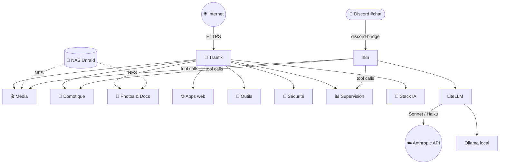
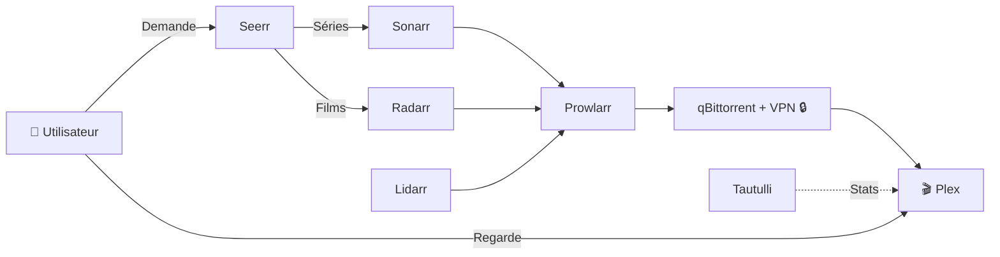
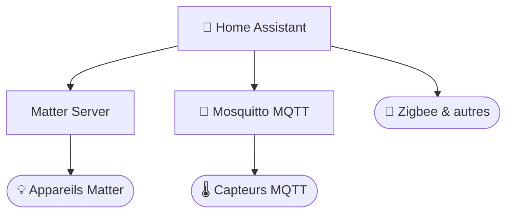
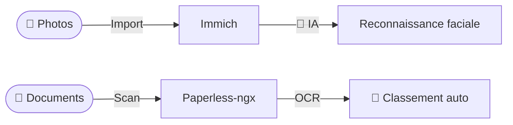
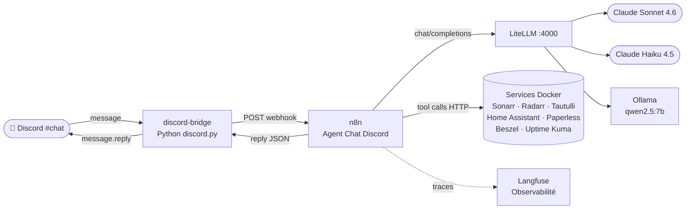
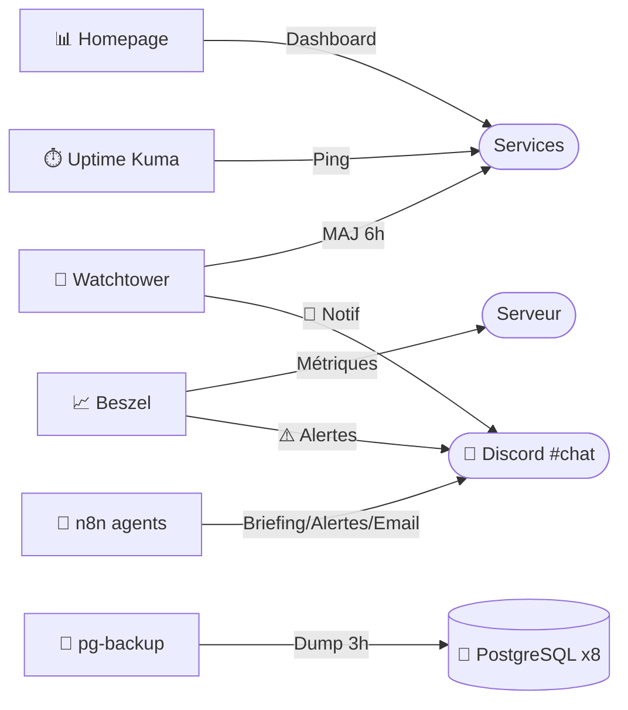
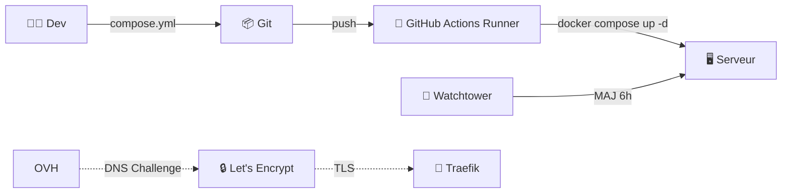

# 🏠 Home Server Platform

> Plateforme auto-hébergée · ~65 containers Docker · Debian · HTTPS automatique via `*.battistella.ovh`

Streaming multimédia, domotique, gestion documentaire, galerie photo, outils de productivité et agents IA — accessible partout, 100% sous votre contrôle.

---

## 🎯 Ce que ça fait

| | Fonctionnalité | Description |
|---|---|---|
| 🎬 | **Streaming multimédia** | Films, séries, musique en streaming avec téléchargement automatisé |
| 📱 | **Demandes de contenu** | Les utilisateurs demandent, le système télécharge automatiquement |
| 🏡 | **Maison connectée** | Contrôle des appareils Matter, MQTT et Zigbee |
| 📸 | **Galerie photo IA** | Reconnaissance faciale et recherche intelligente |
| 📄 | **GED intelligente** | Numérisation OCR et classement automatique |
| 🔐 | **Sécurité** | Mots de passe, secrets, blocage pub DNS |
| 📊 | **Supervision 24/7** | Métriques, logs, alertes Discord, mises à jour auto |
| 🤖 | **Agents IA (Jarvis)** | Bot Discord conversationnel — interroge tous les services en langage naturel |

---

## 🏗️ Architecture

```mermaid
graph TB
    Internet((🌐 Internet)) -->|HTTPS| Traefik[🔀 Traefik]
    Traefik --> Media[🎬 Média]
    Traefik --> Home[🏡 Domotique]
    Traefik --> Photos[📸 Photos & Docs]
    Traefik --> Apps[🌐 Apps web]
    Traefik --> Tools[🔧 Outils]
    Traefik --> Sec[🔐 Sécurité]
    Traefik --> Ops[📊 Supervision]
    Traefik --> AI[🤖 Stack IA]

    NAS[(💾 NAS Unraid)] -.->|NFS| Media
    NAS -.->|NFS| Photos

    Discord([💬 Discord #chat]) -->|discord-bridge| n8n
    n8n --> LiteLLM[LiteLLM]
    n8n -->|tool calls| Media
    n8n -->|tool calls| Home
    n8n -->|tool calls| Ops
    LiteLLM -->|Sonnet / Haiku| Anthropic((☁️ Anthropic API))
    LiteLLM --> Ollama[Ollama local]
```

---

## 🎬 Média & Divertissement

```mermaid
graph LR
    U[👤 Utilisateur] -->|Demande| Seerr
    Seerr -->|Séries| Sonarr
    Seerr -->|Films| Radarr
    Sonarr & Radarr & Lidarr --> Prowlarr
    Prowlarr --> qBit[qBittorrent + VPN 🔒]
    qBit --> Plex[🎬 Plex]
    Tautulli -.->|Stats| Plex
    U -->|Regarde| Plex
```

| Service | Rôle | URL |
|---|---|---|
|  **Plex** | Streaming films, séries, musique | `plex.example.com` |
|  **Seerr** | Demande et découverte de contenu | `seerr.example.com` |
|  **Sonarr** | Gestion automatisée des séries | `sonarr.example.com` |
|  **Radarr** | Gestion automatisée des films | `radarr.example.com` |
|  **Lidarr** | Gestion automatisée de la musique | `lidarr.example.com` |
|  **Prowlarr** | Gestion des indexeurs | `indexer.example.com` |
|  **qBittorrent** | Téléchargement (VPN intégré) | `qbittorrent.example.com` |
|  **Tautulli** | Statistiques Plex | `tautulli.example.com` |

---

## 🏡 Domotique

```mermaid
graph TB
    HA[🏡 Home Assistant] --> Matter[Matter Server]
    HA --> MQTT[🔌 Mosquitto MQTT]
    Matter --> D1([💡 Appareils Matter])
    MQTT --> D2([🌡️ Capteurs MQTT])
    HA --> D3([📡 Zigbee & autres])
```

| Service | Rôle | URL |
|---|---|---|
|  **Home Assistant** | Hub domotique centralisé | `home-assistant.example.com` |
| 🔌 **Mosquitto** | Broker MQTT | _interne_ |
| 🔗 **Matter Server** | Protocole Matter | _interne_ |

### 📋 Dashboards Home Assistant

| Dashboard | Description |
|---|---|
| 🏠 **My Home** | Vue d'ensemble — badges température, humidité et batterie |
| 🗺️ **Map** | Carte de localisation |
| 📊 **Aperçu** | Dashboard principal avec les vues par pièce |

**Vues du dashboard Aperçu :**

| Vue | Icône | Équipements principaux |
|---|---|---|
| 🌳 **Extérieur** | `mdi:pine-tree-variant` | Éclairage, pompe piscine, portail, volet, caméras |
| 🛋️ **Salon** | `mdi:sofa` | Yeelight x2, lumière TV, lumière meuble, volets Tasmota, thermostat, température |
| 💻 **Bureau** | `mdi:monitor` | Ventilateur, éclairage bureau, monitoring baie informatique, température |
| 🛏️ **Chambre parentale** | `mdi:bed-king` | Yeelight, thermostat, température |
| 🛏️ **Chambre Léo** | `mdi:bed` | Yeelight, thermostat, température |
| 🛏️ **Chambre Anna** | `mdi:bed` | Thermostat, température |
| 🚿 **Salle d'eau** | `mdi:shower-head` | Chauffage fil pilote, température |
| 🛁 **Salle de bain** | `mdi:shower` | Thermostat, température |
| 🧹 **Cellier** | `mdi:hanger` | Température |
| 🍳 **Cuisine** | `mdi:fridge` | Thermostat, température |
| 🚽 **WC** | `mdi:toilet` | Thermostat, température |
| 🚪 **Couloir** | `mdi:coat-rack` | Yeelight Mono x2 |

---

## 📸 Photos & Documents

```mermaid
graph LR
    P([📸 Photos]) -->|Import| Immich
    Immich -->|🤖 IA| Reco[Reconnaissance faciale]
    D([📄 Documents]) -->|Scan| Paperless[Paperless-ngx]
    Paperless -->|OCR| Class[📁 Classement auto]
```

| Service | Rôle | URL |
|---|---|---|
|  **Immich** | Galerie photo avec IA | `immich.example.com` |
|  **Paperless-ngx** | GED avec OCR | `paperless.example.com` |

---

## 🌐 Applications personnelles

| Service | Rôle | URL |
|---|---|---|
| ✍️ **Blog** | Blog personnel | `blog.example.com` |
| 📋 **CV en ligne** | Curriculum vitae interactif | `cv.example.com` |
| 🏢 **Copro-Pilot** | Gestion de copropriété | `copro-pilot.example.com` |
| 🎲 **The Box** | Collection de jeux | `the-box.example.com` |
| 🛒 **Toko** | Application e-commerce | `toko.example.com` |
| 🏘️ **WAWPTN** | Gestion de copropriété (v2) + bot Discord | `wawptn.example.com` |
| 🐦 **X AI Weekly Bot** | Bot automatisé de veille IA sur X | `x-ai-weekly-bot.example.com` |
| 🎂 **Birthday Invitation** | Invitation anniversaire | `leo-birthday.example.com` |

---

## 🔧 Outils de productivité

| Service | Rôle | URL |
|---|---|---|
|  **Stirling PDF** | Manipulation PDF | `stirling.example.com` |
|  **Wakapi** | Suivi temps de dev | `wakapi.example.com` |
| 🌳 **Gramps Web** | Généalogie | `gramps.example.com` |

---

## 🔐 Sécurité

| Service | Rôle | URL |
|---|---|---|
|  **Vaultwarden** | Mots de passe (Bitwarden) | `vaultwarden.example.com` |
|  **Infisical** | Secrets applicatifs | `infisical.example.com` |
|  **Pi-hole** | Blocage pub DNS | `pihole.example.com` |

> 🔒 Les secrets (`.env`) ne sont jamais commités. Homepage utilise `{{HOMEPAGE_VAR_*}}` pour la substitution d'environnement.

---

## 🤖 Stack IA — Bot Jarvis

```mermaid
graph LR
    User([👤 Discord #chat]) -->|message| Bridge[discord-bridge\nPython discord.py]
    Bridge -->|POST webhook| n8n[n8n\nAgent Chat Discord]
    n8n -->|chat/completions| LiteLLM[LiteLLM :4000]
    LiteLLM --> Sonnet([Claude Sonnet 4.6])
    LiteLLM --> Haiku([Claude Haiku 4.5])
    LiteLLM --> Ollama[Ollama\nqwen2.5:7b]
    n8n -->|tool calls HTTP| Services[(Services Docker\nSonarr · Radarr · Tautulli\nHome Assistant · Paperless\nBeszel · Uptime Kuma)]
    n8n -->|reply JSON| Bridge
    Bridge -->|message.reply| User
    n8n -.->|traces| Langfuse[Langfuse\nObservabilité]
```

| Service | Rôle | URL |
|---|---|---|
| 🤖 **discord-bridge (Jarvis)** | Bot Discord — écoute `#chat`, forward vers n8n, renvoie la réponse | _interne_ |
| 🔗 **n8n** | Orchestration — 7 workflows (agent chat + 6 automatisations) | `n8n.example.com` |
| ⚡ **LiteLLM** | Proxy LLM unifié — Sonnet, Haiku, qwen2.5:7b, cost tracking | `litellm.example.com` |
| 💬 **Open WebUI** | Interface chat web — PWA mobile, tous modèles | `ai.example.com` |
| 🦙 **Ollama** | LLM local CPU — qwen2.5:7b (4.5 Go RAM, 0 coût API) | _interne_ |
| 📈 **Langfuse** | Observabilité LLM — traces, coûts, latences | `langfuse.example.com` |

### 20 outils disponibles via `#chat`

| Catégorie | Outils |
|---|---|
| 🎬 Multimédia | `sonarr_series`, `sonarr_calendar`, `sonarr_queue`, `radarr_movies`, `radarr_queue`, `tautulli_activity`, `tautulli_history`, `tautulli_stats` |
| 🏡 Domotique | `ha_states`, `ha_entity`, `ha_service`, `ha_history`, `ha_detection_history` |
| 📊 Infrastructure | `beszel_systems`, `beszel_records`, `uptime_kuma_monitors` |
| 📄 Documents | `paperless_documents`, `paperless_search` |
| 🕐 Général | `get_date_time` |

> 💬 Exemples : _"Quelles séries arrivent cette semaine ?"_ · _"Température du salon ?"_ · _"Qui a détecté le portail ce matin ?"_ · _"État du serveur ?"_

---

## 📊 Supervision & Opérations

```mermaid
graph LR
    Homepage[📊 Homepage] -->|Dashboard| S([Services])
    Beszel[📈 Beszel] -->|Métriques| Srv([Serveur])
    Beszel -->|⚠️ Alertes| Discord([💬 Discord #chat])
    Watchtower[🔄 Watchtower] -->|MAJ 6h| S
    Watchtower -->|📢 Notif| Discord
    UptimeKuma[⏱️ Uptime Kuma] -->|Ping| S
    PgBackup[💾 pg-backup] -->|Dump 3h| DB[(🐘 PostgreSQL x8)]
    n8n[🤖 n8n agents] -->|Briefing/Alertes/Email| Discord
```

| Service | Rôle | URL |
|---|---|---|
|  **Homepage** | Tableau de bord | `homepage.example.com` |
|  **Beszel** | Métriques système + alertes Discord | `beszel.example.com` |
|  **Uptime Kuma** | Surveillance disponibilité | `uptime.example.com` |
|  **Portainer** | Gestion Docker | `portainer.example.com` |
|  **Dozzle** | Logs temps réel | `dozzle.example.com` |
| 🔄 **Watchtower** | MAJ auto quotidiennes + alertes Discord | _arrière-plan_ |
| 💾 **pg-backup** | Backup PostgreSQL (8 bases, rétention 7j) | _arrière-plan_ |
|  **Unifi** | Contrôleur réseau | `unifi.example.com` |

---

## 🚀 Déploiement

```mermaid
graph LR
    Dev[👨‍💻 Dev] -->|compose.yml| Git[📦 Git]
    Git -->|push| Runner[🤖 GitHub Actions Runner]
    Runner -->|docker compose up -d| Server[🖥️ Serveur]
    Watchtower[🔄 Watchtower] -->|MAJ 6h| Server
    LE[🔒 Let's Encrypt] -.->|TLS| Traefik[🔀 Traefik]
    OVH -.->|DNS Challenge| LE
```

> Les déploiements se font via 6 runners GitHub Actions self-hosted (`/opt/actions-runner/`). Watchtower met à jour les images quotidiennement.

### GitHub Actions Runners

6 runners self-hosted, un par repo, avec binaires partagés via hardlinks pour économiser ~3.5 Go :

| Runner | Repo | Service |
|--------|------|---------|
| `copro-pilot` | Wifsimster/copro-pilot | copro-pilot |
| `personal-blog` | Wifsimster/personal.blog | blog |
| `toko` | Wifsimster/toko | toko |
| `resume` | Wifsimster/resume | resume |
| `wawptn` | Wifsimster/wawptn | wawptn |
| `x-ai-weekly-bot` | Wifsimster/x-ai-weekly-bot | bot |

---

## ⚙️ Stack technique

| Composant | Technologie |
|---|---|
| 🐳 Orchestration | Docker + Docker Compose |
| 🔀 Proxy inverse | Traefik v3.6 (Let's Encrypt / OVH DNS) |
| 🐘 Bases de données | PostgreSQL 16, Redis / Valkey (~15 instances PostgreSQL) |
| 💾 Sauvegarde | pg-backup — dump quotidien 3h, 8 bases, rétention 7j |
| 📁 Stockage | NAS Unraid via NFS (montage unique `/mnt/media`) |
| 📊 Supervision | Beszel, Uptime Kuma, Dozzle, Portainer, Homepage, Langfuse |
| 🔒 Sécurité | `no-new-privileges`, réseaux internes isolés |
| 🌐 Domaine | `example.com` (sous-domaine par service) |
| 🤖 Agents IA | n8n (orchestration) + LiteLLM (proxy) + discord-bridge (bot Jarvis) |
| ☁️ LLM cloud | Anthropic Claude Sonnet 4.6 / Haiku 4.5 via LiteLLM |
| 🦙 LLM local | Ollama — qwen2.5:7b (CPU, 4.5 Go RAM) |

---

## 💾 Backup PostgreSQL

| Base | Conteneur source |
|---|---|
| 📄 Paperless | `paperless-db` |
| 📸 Immich | `immich_postgres` |
| 🎲 The Box | `the-box-postgres` |
| 🏢 Copro-Pilot | `copro-pilot-postgres` |
| 🔐 Infisical | `infisical-db` |
| ⚡ LiteLLM | `litellm-db` |
| 🔗 n8n | `n8n-db` |
| 📈 Langfuse | `langfuse-db` |

> ⏰ Dump quotidien à 3h · Format `pg_dump -Fc` · 8 bases · Rétention 7 jours · Restauration via `pg_restore`

---

## 🗺️ Feuille de route

### 🔴 Haute priorité

- **Sauvegardes off-site** — Réplication vers S3 / Backblaze B2 / second NAS
- **Tests de restauration** — Validation mensuelle de l'intégrité des backups

### 🟡 Moyenne priorité

- **Secrets centralisés** — Migration `.env` → Infisical (rotation auto)
- **Monitoring TLS** — Alerte avant expiration des certificats
- **Sauvegardes Redis** — Ajouter Redis (Immich, Paperless) au plan de backup

### 🟢 Basse priorité

- **Images versionnées** — Tags fixes sur les services critiques
- **Read-only rootfs** — `read_only: true` sur les conteneurs stateless

### ✅ Terminé

- ~~Rate limiting Vaultwarden~~ · ~~Uptime Kuma~~ · ~~Alertes Beszel → Discord~~
- ~~Healthchecks universels~~ · ~~Limites mémoire~~ · ~~Rotation des logs~~
- ~~Domaine variable~~ · ~~Nettoyage labels Traefik~~ · ~~Sécurité conteneurs~~
- ~~Isolation réseau~~ · ~~Alertes backup Discord~~ · ~~Documentation DR~~
- ~~Stockage NAS unifié~~ — Montage NFS unique `/mnt/media` (hardlinks + déplacements instantanés)
- ~~Mutualisation runners~~ — 6 runners avec binaires partagés via hardlinks (~3.5 Go économisés, voir [#13](https://github.com/Wifsimster/docker-setup/issues/13))
- ~~Optimisation disque~~ — Récupération de 11.8 Go, cleanup automatique hebdomadaire (`/opt/docker/disk-cleanup.sh`)
- ~~Stack IA complète~~ — LiteLLM + Open WebUI + n8n (7 workflows) + Langfuse + Ollama + bot Jarvis
- ~~Bot Discord Jarvis~~ — Agent unifié Sonnet 4.6 avec 20 outils, canal unique `#chat`, tool-calling réel vers tous les services Docker

---

## 📚 Documentation

| Document | Description |
|---|---|
| 📖 [Stack Multimédia](multimedia/README.md) | Architecture de la pile multimédia |
| 🔀 [Traefik](docs/traefik.md) | Proxy inverse, TLS, middlewares |
| 💾 [Stockage NFS](docs/stockage-nfs.md) | Montages Unraid, limitations |
| ➕ [Ajout d'un service](docs/ajout-service.md) | Guide pas à pas |
| 🐘 [Bases de données](docs/bases-de-donnees.md) | PostgreSQL, Redis, healthchecks |
| 🚨 [Reprise après sinistre](docs/reprise-sinistre.md) | Runbook de restauration |
| 🤖 [CLAUDE.md](CLAUDE.md) | Guide pour assistants IA |
