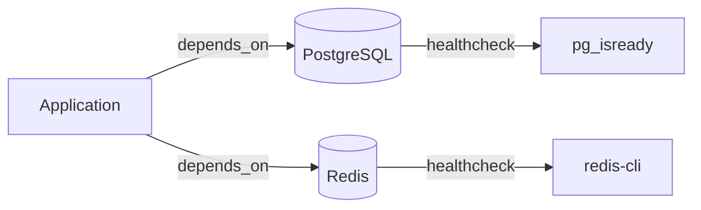

# Ajout d'un nouveau service

Ce document est un guide pas à pas pour ajouter un nouveau service à la plateforme. Il couvre la création du fichier Compose, le routage Traefik, la gestion des secrets et l'intégration au tableau de bord.

## Étapes

### 1. Créer le répertoire

```bash
mkdir <nom-du-service>
```

Le nom doit être en **minuscules, séparé par des tirets** (ex : `mon-service`).

### 2. Créer le fichier compose.yml

Utiliser ce modèle de base :

```yaml
name: nom-du-service

services:
  service:
    container_name: nom-du-service
    image: registry/image:tag
    restart: unless-stopped
    environment:
      - TZ=Europe/Paris
      - PUID=1000
      - PGID=1000
    labels:
      - "traefik.enable=true"
      - "traefik.http.routers.nom-du-service.entrypoints=websecure"
      - "traefik.http.routers.nom-du-service.rule=Host(`nom-du-service.battistella.ovh`)"
      - "traefik.http.services.nom-du-service.loadBalancer.server.port=PORT"
      - "com.centurylinklabs.watchtower.enable=true"
    networks:
      lan:

networks:
  lan:
    external: true
```

### 3. Configurer les labels Traefik

Le nom du routeur doit être **identique** dans les trois labels :

| Label | Rôle |
|---|---|
| `traefik.http.routers.NOM.entrypoints` | Point d'entrée HTTPS |
| `traefik.http.routers.NOM.rule` | Sous-domaine de routage |
| `traefik.http.services.NOM.loadBalancer.server.port` | Port du conteneur |

### 4. Créer le fichier .env

Pour tout secret (mot de passe, clé API, token) :

```bash
touch <nom-du-service>/.env
```

Puis référencer les variables dans le compose.yml avec `${VARIABLE}`. Le fichier `.env` est **automatiquement ignoré par git**.

### 5. Démarrer le service

```bash
cd <nom-du-service> && docker compose up -d
```

### 6. Vérifier le fonctionnement

- Accéder à `https://nom-du-service.battistella.ovh`
- Vérifier les logs : `docker compose logs -f`
- Vérifier dans Traefik : `proxy.battistella.ovh`

### 7. Ajouter au tableau de bord Homepage (optionnel)

Éditer `homepage/config/services.yaml` pour ajouter le widget du service.

### 8. Mettre à jour la documentation

- Ajouter le service dans le `README.md` (tableau de la section concernée)
- Mettre à jour `CLAUDE.md` si nécessaire

## Ajout d'un service avec base de données



Pour les services nécessitant une base de données, suivre ce modèle :

```yaml
services:
  db:
    image: postgres:16-alpine
    container_name: nom-du-service-db
    restart: unless-stopped
    environment:
      POSTGRES_DB: nom_db
      POSTGRES_USER: utilisateur
      POSTGRES_PASSWORD: ${DB_PASSWORD}
    volumes:
      - pg_data:/var/lib/postgresql/data
    healthcheck:
      test: ["CMD-SHELL", "pg_isready -U utilisateur -d nom_db"]
      interval: 10s
      timeout: 5s
      retries: 5
    networks:
      - lan

  redis:
    image: redis:7-alpine
    container_name: nom-du-service-redis
    restart: unless-stopped
    volumes:
      - redis_data:/data
    healthcheck:
      test: ["CMD", "redis-cli", "ping"]
      interval: 10s
      timeout: 5s
      retries: 5
    networks:
      - lan

  app:
    depends_on:
      db:
        condition: service_healthy
      redis:
        condition: service_healthy

volumes:
  pg_data:
  redis_data:
```

**Points clés :**

- Utiliser `postgres:16-alpine` pour PostgreSQL
- Utiliser `redis:7-alpine` ou `valkey:8-alpine` pour le cache
- Toujours définir un **healthcheck** sur les bases de données
- Utiliser `depends_on` avec `condition: service_healthy`
- Utiliser des **volumes nommés** pour la persistance

## Checklist

- [ ] Répertoire créé en minuscules avec tirets
- [ ] `compose.yml` avec labels Traefik cohérents
- [ ] Label Watchtower pour les mises à jour automatiques
- [ ] Réseau `lan` déclaré comme externe
- [ ] Fichier `.env` pour les secrets (jamais de valeurs en dur)
- [ ] Service démarré et accessible en HTTPS
- [ ] README.md mis à jour
