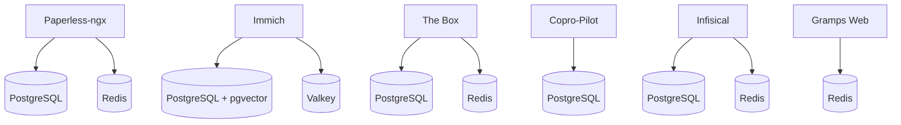

# Bases de données — PostgreSQL et Redis

Ce document décrit la configuration des bases de données utilisées par la plateforme. Il couvre PostgreSQL pour le stockage relationnel et Redis/Valkey pour le cache et les files de tâches.

## Vue d'ensemble



Chaque service qui a besoin d'une base de données embarque **ses propres conteneurs** PostgreSQL et/ou Redis. Il n'y a pas de serveur de base de données partagé.

## Services utilisant PostgreSQL

| Service | Conteneur | Image | Base de données |
|---|---|---|---|
| **Paperless-ngx** | `paperless-db` | `postgres:16-alpine` | `paperless` |
| **Immich** | `immich_postgres` | Image custom avec pgvector | Variable `.env` |
| **The Box** | `the-box-postgres` | `postgres:16-alpine` | Variable `.env` |
| **Copro-Pilot** | `copro-pilot-postgres` | `postgres:16-alpine` | Variable `.env` |
| **Infisical** | `infisical-db` | `postgres:14-alpine` | Variable `.env` |

## Services utilisant Redis / Valkey

| Service | Conteneur | Image | Rôle |
|---|---|---|---|
| **Paperless-ngx** | `paperless-redis` | `redis:7-alpine` | File de tâches |
| **Immich** | `immich_redis` | `valkey:8-alpine` | Cache |
| **The Box** | `the-box-redis` | `redis:alpine` | Cache |
| **Infisical** | `infisical-redis` | `redis:7-alpine` | Cache |
| **Gramps Web** | `grampsweb-redis` | `redis:7.2.4-alpine` | File de tâches Celery |

## Healthchecks

Chaque base de données déclare un **healthcheck** pour que les services dépendants ne démarrent qu'une fois la base prête.

### PostgreSQL

```yaml
healthcheck:
  test: ["CMD-SHELL", "pg_isready -U utilisateur -d nom_db"]
  interval: 10s
  timeout: 5s
  retries: 5
  start_period: 30s
```

### Redis / Valkey

```yaml
healthcheck:
  test: ["CMD", "redis-cli", "ping"]
  interval: 10s
  timeout: 5s
  retries: 5
```

## Dépendances de démarrage

Les services applicatifs attendent la disponibilité des bases grâce à `depends_on` :

```yaml
depends_on:
  db:
    condition: service_healthy
  redis:
    condition: service_healthy
```

Le conteneur applicatif ne démarre que lorsque le healthcheck des bases de données renvoie un statut sain.

## Persistance des données

Toutes les données sont stockées dans des **volumes Docker nommés** :

| Type | Convention de nommage | Exemple |
|---|---|---|
| PostgreSQL | `pg_data` | `pg_data:/var/lib/postgresql/data` |
| Redis | `redis_data` | `redis_data:/data` |

Les volumes nommés persistent même si le conteneur est supprimé. Ils sont stockés sur le disque local du serveur (pas sur le NAS).

## Cas particulier : Immich

> **Détail technique**

Immich utilise une image PostgreSQL personnalisée incluant les extensions **pgvector** et **pgvectors**. Ces extensions permettent la recherche vectorielle pour la reconnaissance faciale et la recherche intelligente de photos.

L'image est épinglée par son hash SHA256 pour garantir la compatibilité.

## Bonnes pratiques

- **Un conteneur de base de données par service** — Pas de base partagée
- **Mots de passe dans `.env`** — Jamais en dur dans le compose.yml
- **Volumes nommés** — Pour la persistance des données
- **Healthchecks obligatoires** — Sur chaque base de données
- **`depends_on` avec condition** — Pour un démarrage ordonné
