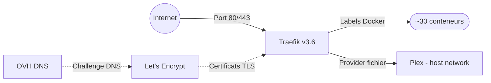

# Traefik — Proxy inverse et certificats TLS

Ce document explique le fonctionnement de Traefik, le point d'entrée unique de toute l'infrastructure. Il couvre le routage, les certificats HTTPS et les middlewares de sécurité.

## Rôle de Traefik

Traefik est le **proxy inverse** de la plateforme. Il remplit trois fonctions :

- **Router** chaque sous-domaine `*.battistella.ovh` vers le bon conteneur
- **Générer et renouveler** les certificats TLS via Let's Encrypt
- **Appliquer** des règles de sécurité HTTP (headers HSTS, XSS, etc.)

## Comment ça fonctionne



Traefik découvre automatiquement les services via les **labels Docker**. Chaque conteneur déclare son sous-domaine et son port. Traefik crée le routage sans configuration manuelle. Exception : Plex utilise le réseau hôte, donc son routage passe par un fichier de configuration statique.

## Points d'entrée

| Point d'entrée | Port | Rôle |
|---|---|---|
| `web` | 80 | HTTP — redirige vers HTTPS |
| `websecure` | 443 | HTTPS — point d'entrée principal |

Toutes les requêtes HTTP sont automatiquement redirigées vers HTTPS.

## Certificats TLS

Les certificats sont obtenus via **Let's Encrypt** avec le **challenge DNS OVH** :

- Le challenge DNS ne nécessite pas d'ouvrir le port 80 pour la validation
- Les certificats couvrent chaque sous-domaine individuellement
- Le renouvellement est automatique
- Les certificats sont stockés dans `traefik/acme/letsencrypt.json`

> **Détail technique**

Les variables OVH nécessaires sont dans le fichier `.env` de Traefik :
- `OVH_APPLICATION_KEY`
- `OVH_APPLICATION_SECRET`
- `OVH_CONSUMER_KEY`
- `OVH_ENDPOINT`

## Labels Docker

Chaque service déclare son routage via des labels. Le nom du routeur doit être **cohérent** dans tous les labels :

```yaml
labels:
  - "traefik.enable=true"
  - "traefik.http.routers.ROUTEUR.entrypoints=websecure"
  - "traefik.http.routers.ROUTEUR.rule=Host(`sous-domaine.battistella.ovh`)"
  - "traefik.http.services.ROUTEUR.loadBalancer.server.port=PORT"
```

## Provider fichier

Pour les services qui n'utilisent pas le réseau Docker `lan` (comme Plex en mode hôte), le routage se fait via des fichiers YAML dans `traefik/config/`.

Le fichier `traefik/config/plex.yml` définit le routage vers Plex sur le port 32400 de l'hôte.

## Middlewares de sécurité

Traefik applique des **headers de sécurité** sur le dashboard :

| Header | Fonction |
|---|---|
| **HSTS** | Force HTTPS pendant 1 an avec sous-domaines |
| **X-XSS-Protection** | Protection contre les attaques XSS |
| **X-Content-Type-Options** | Empêche le sniffing de type MIME |

## Timeouts étendus

Les timeouts de lecture et écriture sont configurés à **600 secondes**. Cela permet l'upload de fichiers volumineux, notamment les vidéos vers Immich.

## Tableau de bord

Le dashboard Traefik est accessible sur `proxy.battistella.ovh`. Il offre une vue d'ensemble de tous les routeurs, services et middlewares actifs.

## Logs

Traefik journalise en format JSON :

- **Logs d'accès** : requêtes avec codes d'erreur 400-599 uniquement
- **Logs applicatifs** : niveau WARN minimum
- Stockés dans `traefik/logs/`
