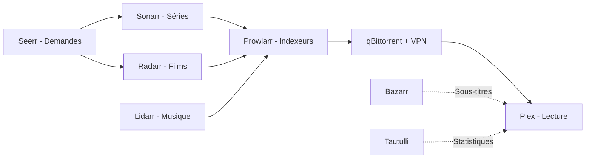

# Stack Multimédia

Pile de services Docker pour l'acquisition, l'organisation et le streaming de contenu multimédia. Ce document couvre l'architecture, la configuration et le fonctionnement de la pile.

## Services

| Service | Image | Port | URL | Fonction |
|---|---|---|---|---|
| **Plex** | `lscr.io/linuxserver/plex` | 32400 | `plex.battistella.ovh` | Streaming films, séries et musique |
| **Sonarr** | `lscr.io/linuxserver/sonarr` | 8989 | `sonarr.battistella.ovh` | Gestion automatisée des séries |
| **Radarr** | `lscr.io/linuxserver/radarr` | 7878 | `radarr.battistella.ovh` | Gestion automatisée des films |
| **Lidarr** | `lscr.io/linuxserver/lidarr` | 8686 | `lidarr.battistella.ovh` | Gestion automatisée de la musique |
| **Bazarr** | `lscr.io/linuxserver/bazarr` | 6767 | `bazarr.battistella.ovh` | Gestion des sous-titres |
| **Prowlarr** | `lscr.io/linuxserver/prowlarr` | 9696 | `indexer.battistella.ovh` | Gestion des indexeurs de recherche |
| **qBittorrent** | `ghcr.io/hotio/qbittorrent` | 8080 | `qbittorrent.battistella.ovh` | Client de téléchargement avec VPN (ProtonVPN) |
| **Seerr** | `ghcr.io/hotio/seerr` | 5055 | `seerr.battistella.ovh` | Demande et découverte de contenu |
| **Tautulli** | `lscr.io/linuxserver/tautulli` | 8181 | `tautulli.battistella.ovh` | Statistiques d'utilisation de Plex |

## Architecture



L'utilisateur demande du contenu via Seerr. Les gestionnaires (Sonarr, Radarr, Lidarr) interrogent les indexeurs via Prowlarr. Le téléchargement passe par qBittorrent, protégé par un VPN WireGuard. Le contenu est ensuite disponible dans Plex.

## Prérequis

- Docker et Docker Compose installés
- Réseau Docker externe `lan` créé (`docker network create lan`)
- Traefik configuré avec le provider Docker et le provider fichier (pour Plex)
- Points de montage NFS : `/mnt/downloads`, `/mnt/movies`, `/mnt/tv-shows`, `/mnt/musics`
- Fichier WireGuard pour ProtonVPN dans `./wireguard/wg0.conf`

## Démarrage rapide

1. Copier le fichier d'environnement et l'éditer :
   ```bash
   cp .env.example .env
   nano .env
   ```

2. Placer la configuration WireGuard dans `./wireguard/wg0.conf`

3. Démarrer la pile :
   ```bash
   docker compose up -d
   ```

## Variables d'environnement

### Générales

| Variable | Description | Défaut |
|---|---|---|
| `TZ` | Fuseau horaire | `Europe/Paris` |
| `PUID` | ID utilisateur pour les permissions | `1000` |
| `PGID` | ID groupe pour les permissions | `1000` |
| `DOMAIN` | Domaine de base pour le routage Traefik | `battistella.ovh` |

### Chemins des médias

| Variable | Description | Défaut |
|---|---|---|
| `DOWNLOADS_LOCATION` | Répertoire de téléchargement | `/mnt/downloads` |
| `TV_SHOWS_LOCATION` | Bibliothèque de séries | `/mnt/tv-shows` |
| `MOVIES_LOCATION` | Bibliothèque de films | `/mnt/movies` |
| `MUSIC_LOCATION` | Bibliothèque musicale | `/mnt/musics` |

### Chemins de configuration des services

Chaque service stocke ses données persistantes dans un répertoire relatif :

| Variable | Défaut |
|---|---|
| `BAZARR_CONFIG_PATH` | `../bazarr/data` |
| `LIDARR_CONFIG_PATH` | `../lidarr/config` |
| `SEERR_CONFIG_PATH` | `../overseerr/data` |
| `PLEX_CONFIG_PATH` | `../plex/library` |
| `PROWLARR_CONFIG_PATH` | `../prowlarr/data` |
| `RADARR_CONFIG_PATH` | `../radarr/data` |
| `SONARR_CONFIG_PATH` | `../sonarr/data` |
| `TAUTULLI_CONFIG_PATH` | `../tautulli/config` |
| `CONFIG_LOCATION` (qBittorrent) | `../qbittorrent/data` |

### qBittorrent et VPN

| Variable | Description | Défaut |
|---|---|---|
| `VPN_ENABLED` | Activer le VPN WireGuard | `true` |
| `VPN_CONF` | Nom du fichier de configuration WireGuard | `wg0` |
| `VPN_PROVIDER` | Fournisseur VPN | `proton` |
| `VPN_LAN_NETWORK` | CIDR du réseau local (contournement VPN) | `192.168.1.0/24` |
| `VPN_AUTO_PORT_FORWARD` | Transfert de port automatique | `true` |
| `BT_PORT` | Port d'écoute BitTorrent (hôte) | `6881` |

### Plex

| Variable | Description | Défaut |
|---|---|---|
| `PLEX_VERSION` | Type de version Plex | `docker` |
| `PLEX_CLAIM` | Jeton de revendication Plex (depuis plex.tv/claim) | — |

## Plex et Traefik

> **Détail technique**

Plex fonctionne en `network_mode: host` pour la découverte DLNA. Traefik ne peut donc pas le router via les labels Docker. Le routage se fait via le **provider fichier** dans `traefik/config/plex.yml`.

Remplacer `<HOST_IP>` par l'adresse IP LAN du serveur dans ce fichier.

## Montages de volumes

| Service | Configuration | Médias / Données |
|---|---|---|
| Bazarr | `/config` | `/tv`, `/movies` |
| Lidarr | `/config` | `/music`, `/downloads` |
| Seerr | `/config` | — |
| Plex | `/config` | `/tv`, `/movies`, `/musics` |
| Prowlarr | `/config` | — |
| qBittorrent | `/config` | `/data/downloads` |
| Radarr | `/config` | `/movies`, `/downloads` |
| Sonarr | `/config` | `/tv`, `/downloads` |
| Tautulli | `/config` | `/logs` (logs Plex, lecture seule) |

## Réseau

- Tous les services (sauf Plex) utilisent le réseau Docker externe `lan`
- Plex utilise `network_mode: host` pour la découverte DLNA
- qBittorrent route tout son trafic via un tunnel VPN WireGuard (ProtonVPN)

## Transcodage matériel

> **Détail technique**

Plex dispose du passthrough `/dev/dri` pour le transcodage matériel Intel QuickSync / VAAPI. L'utilisateur système doit appartenir au groupe `render` :

```bash
sudo usermod -aG render <username>
```

## Mises à jour automatiques

Tous les services portent le label Watchtower pour la mise à jour automatique des images.

## Commandes utiles

```bash
# Démarrer tous les services
docker compose up -d

# Redémarrer un service
docker compose restart sonarr

# Voir les logs
docker compose logs -f radarr

# Mettre à jour les images
docker compose pull && docker compose up -d
```
