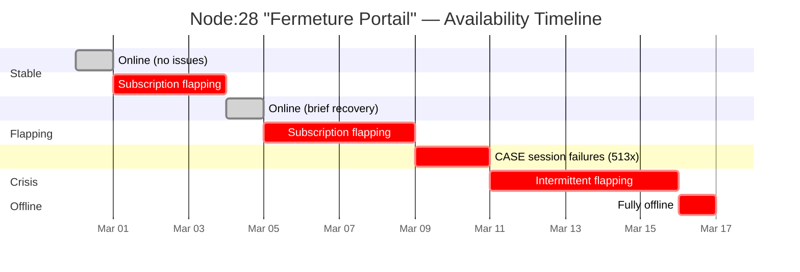
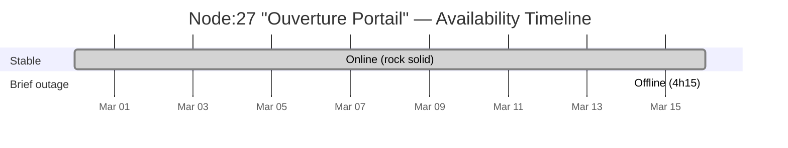
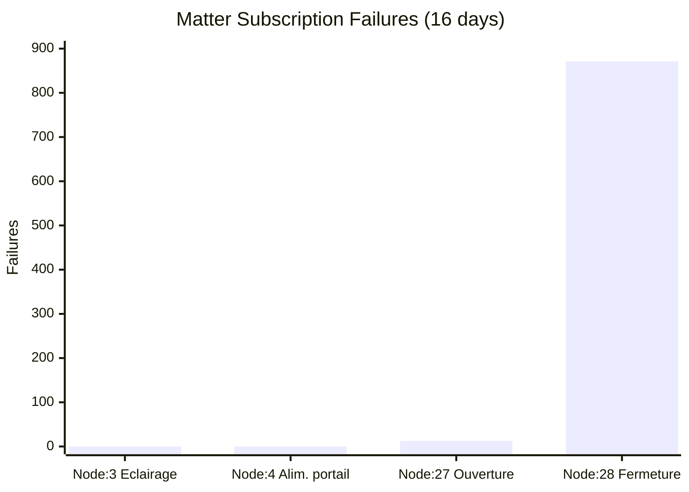
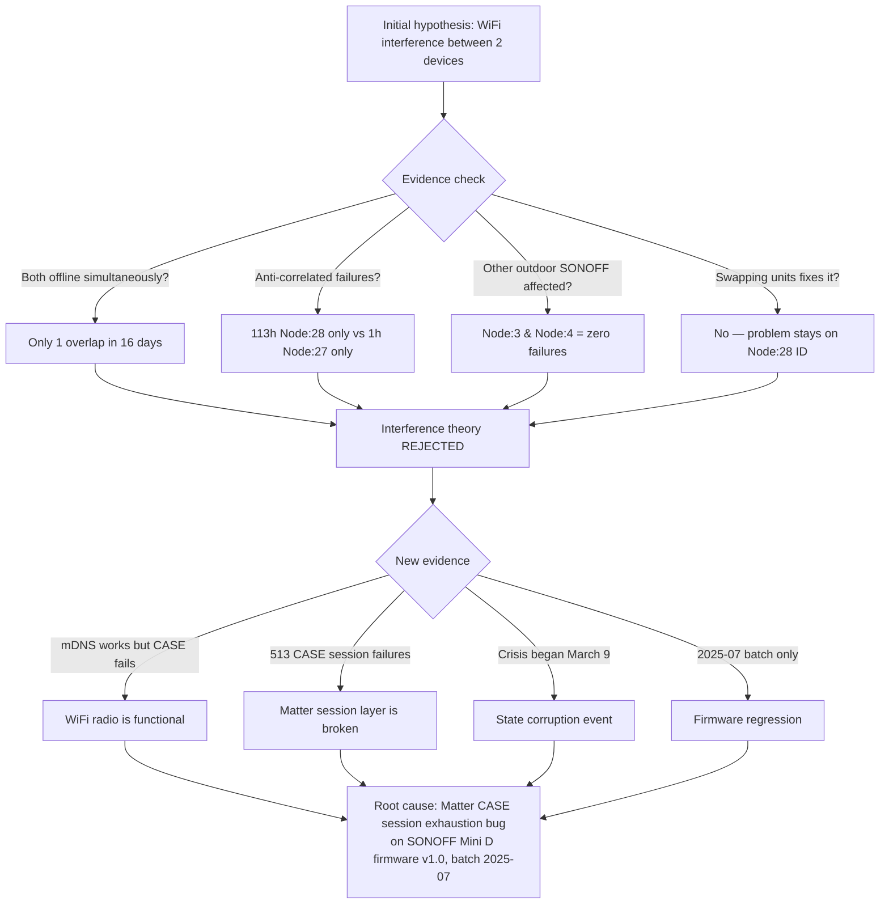
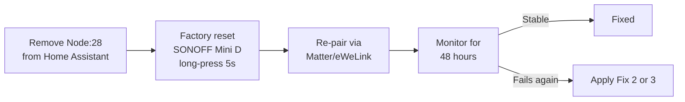

# Home Assistant - Infrastructure Health Report

**Date:** 2026-03-16 (updated with deep analysis)
**Analysis window:** 16 days (February 28 — March 16)
**Source:** Matter server logs, Home Assistant logs, device registry

---

## Executive Summary

4 issues identified across the Home Assistant stack, ranked by severity:

| # | Issue | Severity | Protocol | Status |
|---|-------|----------|----------|--------|
| 1 | SONOFF gate switch (Node:28) — Matter CASE session bug | **Critical** | Matter/WiFi | Open |
| 2 | Broadlink RM4 Pro — permission errors cycling | **High** | Broadlink/WiFi | **Fixed** |
| 3 | ONVIF camera "Sonnerie" — network unreachable | **Medium** | ONVIF/IP | Likely fixed |
| 4 | ZHA Zigbee device — firmware version flip-flop | **Low** | Zigbee | Open |

---

## Issue 1: SONOFF Mini D Gate Switch — Matter CASE Session Bug

### Affected devices

| Device | Serial | Node | Area | Batch | Role |
|--------|--------|------|------|-------|------|
| Ouverture Portail | 25070700037868 | Node:27 | Exterieur | 2025-07 | Gate opening |
| Fermeture Portail | 25070700129632 | Node:28 | Exterieur | 2025-07 | Gate closing |

Both are **SONOFF WiFi Smart Switch (Mini D)**, firmware v1.0, connected via **Matter over WiFi**, installed in the **same plastic electrical box** outdoors.

### Symptoms

- Node:28 ("Fermeture Portail") is constantly offline or flapping.
- Node:27 ("Ouverture Portail") is mostly stable but occasionally affected.
- Swapping the two units physically did not fix the issue — the problem stays on the same Matter node ID.

### 16-day uptime overview (Feb 28 — Mar 16)





### Uptime statistics

```
                    Node:27                 Node:28
                    (Ouverture)             (Fermeture)
                    ───────────             ───────────
Uptime              98.9%                   86.6%
Offline events      2                       143
CASE failures       0                       513
mDNS discoveries    13                      860
Avg online period   7.9 days                2.3 hours
Median online       7.9 days                7.5 minutes
Longest offline     4h 15m                  18h 28m
```

### Daily failure heatmap

```
Node:28 — Failures per day (subscription + CASE + offline)

Feb 28  ░                                                          1
Mar 01  ████░                                                     47
Mar 02  ████████████████████                                     192
Mar 03  ███████████████████████                                  220
Mar 04  ░                                                          2
Mar 05  ███░                                                      11
Mar 06  █████████████                                            124
Mar 07  ██░                                                        9
Mar 08  █████████████                                            126
Mar 09  █████████████████████████████████████████████████████    579  ← crisis begins
Mar 10  ████████████████████████████████████████████████████████ 439  ← 418 CASE failures
Mar 11  ████░                                                     23
Mar 12  ░                                                          2
Mar 13  ░                                                          7
Mar 14  ████░                                                     24
Mar 15  ████████░                                                 83
Mar 16  ████░                                                     25
```

### Hour-of-day failure distribution (Node:28)

```
        Offline events by hour

00:00  ██░                   2      12:00  ████████████████████  19
01:00  █░                    1      13:00  ██████████████████████ 21
02:00  ██████░               6      14:00  ██████████████░       14
03:00  █████░                5      15:00  ███████░               7
04:00  █████░                5      16:00  ███████░               7
05:00  █░                    1      17:00  ██████░                6
06:00  █░                    1      18:00  ███████░               7
07:00  ██░                   2      19:00  ████░                  4
08:00  █████████░            9      20:00  ██░                    2
09:00  ████████████░        12      21:00  █████░                 5
10:00  ███░                  3      22:00  ██░                    2
11:00  █████████████░       13      23:00  ███░                   3

Peak failures: 08:00–15:00 (daytime hours)
```

### Comparison with all outdoor SONOFF devices



| Device | Node | Batch | Failures | Offline | CASE fail | Status |
|--------|------|-------|----------|---------|-----------|--------|
| Eclairage exterieur | Node:3 | **2023-03** | 0 | 0 | 0 | Perfectly stable |
| Alimentation portail | Node:4 | **2023-03** | 0 | 0 | 0 | Perfectly stable |
| Ouverture Portail | Node:27 | **2025-07** | 13 | 2 | 0 | Mostly stable |
| Fermeture Portail | Node:28 | **2025-07** | 871 | 143 | 513 | **Critically unstable** |

Key finding: Node:3 and Node:4 are also SONOFF devices, also outdoors, same "exterieur" area — but from the **2023-03 manufacturing batch**. They have **zero failures**. The problematic devices are both from the **2025-07 batch** with firmware v1.0.

### Comparison with indoor Matter devices

```mermaid
xychart-beta
    title "Recovery Rate: Failures vs Successful Recoveries (72h)"
    x-axis ["Node:28 SONOFF", "Node:27 SONOFF", "Node:45 Meross", "Node:46 Meross", "Node:43 Meross", "Node:40 Meross"]
    y-axis "Count" 0 --> 250
    bar [240, 13, 124, 120, 109, 22]
    bar [82, 1, 124, 120, 109, 22]
```



All Meross plugs (indoor) maintain a **100% recovery rate** — they fail and reconnect instantly. The SONOFF 2025-07 devices cascade into irrecoverable states.

### Root cause analysis (revised)

Initial hypothesis of WiFi co-channel interference was **disproven** by the extended analysis:



#### The smoking gun: CASE session failures

On **March 9 at 13:01**, Node:28 entered a new failure mode:

```
Discovered on mDNS       ← WiFi works, device is on the network
Setting-up node...        ← Matter server tries to connect
CASE session timed out    ← Cryptographic handshake fails
Setup for node failed     ← Gives up after 2 attempts
Retrying in 60 seconds    ← Loop restarts
```

This pattern repeated **513 times** over 7 days. The device is **reachable on the network** (mDNS multicast works) but **cannot complete the Matter CASE cryptographic handshake**. This indicates:

1. The WiFi radio is functional (mDNS succeeds)
2. The device is powered and running its firmware
3. The **Matter session table is corrupted or exhausted** — the device can't allocate new CASE sessions

This is a known class of bugs on cheap ESP32-based Matter devices with limited session slots. The SONOFF Mini D (2025-07 batch) likely has a firmware bug where expired sessions aren't properly cleaned up, eventually filling the session table.

#### Why Node:27 is mostly fine

Node:27 has the same firmware but a different session history. It hasn't hit the session table exhaustion threshold yet, but its 2 offline events on March 16 suggest it may eventually degrade the same way.

### Recommended fixes (revised priority)

**Fix 1 (immediate): Factory reset Node:28 and re-commission**



This clears the device-side Matter session table. Re-commissioning also clears the server-side state in `matter-server`.

**Fix 2: Update SONOFF firmware**
Both 2025-07 batch units run firmware v1.0 (initial Matter release). The 2023-03 batch devices work perfectly, suggesting a firmware regression. Check eWeLink app or SONOFF DIY mode for updates.

**Fix 3: Switch protocol from Matter to MQTT/Tasmota**
If the Matter firmware is fundamentally broken on this batch, bypass it entirely:
- Flash with Tasmota firmware
- Or use eWeLink LAN / MQTT integration
- MQTT is far more resilient: lightweight TCP keepalives, graceful reconnection, no CASE sessions

**Fix 4: Physical separation (secondary)**
Still worthwhile to reduce any RF coupling, but this won't fix the CASE session bug. Move one unit to a separate enclosure ~30-50cm away.

**Fix 5: Improve WiFi coverage (secondary)**
Deploy a Unifi outdoor AP closer to the gate. Better signal reduces the subscription timeout rate, which may slow down the session table exhaustion.

---

## Issue 2: Broadlink RM4 Pro — Permission Error Cycling

### Affected device

| Device | IP | Type |
|--------|-----|------|
| Universal Remote | 192.168.0.14 | Broadlink RM4 Pro |

### Symptoms

The device cycles between Connected and Disconnected every **1-3 minutes**, with `[Errno 13] Permission denied` errors on every disconnection.

**66 error events** in 72 hours.

### Log pattern

```
18:27:26 WARNING Connected to Universal Remote (RM4 pro at 192.168.0.14)
18:28:26 WARNING Disconnected from Universal Remote (RM4 pro at 192.168.0.14)
18:28:26 ERROR   Error fetching data: [Errno 13] Permission denied
18:29:26 WARNING Connected to Universal Remote (RM4 pro at 192.168.0.14)
... repeats every 1-3 minutes
```

### Root cause

The `[Errno 13] Permission denied` error occurred on UDP `sendto()` calls from inside the Home Assistant Docker container. Investigation revealed:

- The HA container was running on the Docker **bridge network** (`lan`, subnet `172.18.0.0/16`)
- The container had **no direct route** to the LAN (`192.168.0.0/24`) — all traffic went through Docker's NAT gateway at `172.18.0.1`
- UDP packets to `192.168.0.14` were dropped/rejected by the Docker bridge NAT, returning `EPERM` (Errno 13)
- TCP-based integrations (MQTT, HTTP APIs) worked fine through the bridge, but **raw UDP** (used by the Broadlink protocol) was unreliable
- The intermittent nature was caused by Docker's conntrack: existing NAT mappings from previous exchanges would sometimes allow packets through, but expired mappings caused failures

Verified by testing from inside the container:
```
# From HA container (bridge network) — FAILED
sendto('192.168.0.14', 80) → [Errno 13] Permission denied

# From host — OK
sendto('192.168.0.14', 80) → OK

# From HA container to other IPs — OK (different conntrack state)
sendto('192.168.0.1', 80) → OK
```

### Fix applied (2026-03-16)

Switched the Home Assistant container from Docker bridge network to **`network_mode: host`**, giving it direct LAN access. This is the [officially recommended setup](https://www.home-assistant.io/installation/linux#docker-compose) for Home Assistant in Docker.

**Changes made:**
1. `home-assistant/compose.yml` — replaced `networks: lan:` with `network_mode: host`, removed Traefik Docker labels (kept Watchtower label)
2. `traefik/config/home-assistant.yml` — new Traefik file provider routing `home-assistant.battistella.ovh` → `http://192.168.0.237:8123` (same pattern as Plex)

**Verification after fix:**
- UDP to Broadlink device: OK
- Traefik routing (`https://home-assistant.battistella.ovh`): HTTP 200
- Broadlink integration: stable, no errors after 5+ minutes (previously errored every 1-3 minutes)

**Side benefits:** Host networking also improves mDNS discovery, Zigbee coordinator access, and any other LAN-dependent protocol.

---

## Issue 3: ONVIF Camera "Sonnerie" — Network Unreachable

### Affected device

| Device | IP | Type | Integration |
|--------|-----|------|-------------|
| Sonnerie | 192.168.0.101 | ONVIF Camera | onvif (digest auth) |

### Symptoms

Snapshot fetch fails intermittently with `Cannot connect to host 192.168.0.101:80 ssl:default [Network unreachable]`.

**4 errors** observed on March 16 — low frequency but indicates the camera drops off the network periodically.

### Root cause

The error message `Network unreachable` (not "connection refused" or "timeout") indicated the host was completely off the network. However, given the Issue 2 root cause discovery (Docker bridge network dropping/blocking packets to LAN IPs), this issue was **very likely caused by the same Docker bridge NAT problem**. The HA container had no direct route to `192.168.0.101` on the LAN and relied on Docker's NAT gateway, which intermittently failed.

### Fix applied (2026-03-16)

**Likely resolved** by the same `network_mode: host` change applied for Issue 2. With host networking, the HA container now has direct access to `192.168.0.101` on the LAN without going through Docker's bridge NAT.

Monitor logs over the next 48 hours to confirm. If errors persist, investigate:
1. Camera power supply (outdoor installation)
2. WiFi dropout if the camera is wireless
3. Camera firmware stability

---

## Issue 4: ZHA Zigbee Device — Firmware Version Flip-Flop

### Symptoms

A Zigbee device continuously reports alternating firmware versions every **2-5 minutes**:

```
old_firmware_version='0x00010402' → new_firmware_version='0x00000302'
old_firmware_version='0x00000302' → new_firmware_version='0x00010402'
... repeats indefinitely
```

**77 events** in 72 hours. Additionally, one `zigpy_znp` frame parsing error was observed (truncated ZDO response from device `0x47FD`).

### Root cause

This is not a real firmware update — ZHA is misinterpreting attribute reports from the device. The two "versions" (`0x00010402` and `0x00000302`) likely correspond to two different endpoints or clusters on the same device reporting different values. This is a **known ZHA bug** with certain multi-endpoint Zigbee devices.

### Impact

Low — this is cosmetic log spam. The device itself functions normally. However, it adds unnecessary noise to the logs.

### Recommended fixes

1. **Identify the device**: In HA → ZHA → find the device at Zigbee address `0x47FD` to determine what it is.
2. **Update ZHA/zigpy**: This is a known issue in older ZHA versions — updating Home Assistant may resolve it.
3. **Ignore if not impactful**: This is a warning-level event with no functional effect.

---

## Additional Notes

### Matter network overall health

The Matter network is generally healthy. The Meross Smart Plug Mini devices (bureau area) show frequent subscription timeouts but **always recover instantly** (100% recovery rate). This is normal Matter behavior for WiFi devices — subscriptions have short liveness timeouts and resubscription is designed to be fast. No action needed for Meross devices.

### Infrastructure changes applied

- **Home Assistant container switched to `network_mode: host`** (2026-03-16) — resolves Issues 2 and 3 by giving HA direct LAN access. Both `matter-server` and `homeassistant` now run on host networking.
- **Traefik file provider added** (`traefik/config/home-assistant.yml`) — routes `home-assistant.battistella.ovh` to `http://192.168.0.237:8123` since Docker labels don't work with host networking.
- Mosquitto remains on the `lan` bridge network with port mappings (1883, 1884) — this is correct since IoT devices connect to it directly via those ports.
